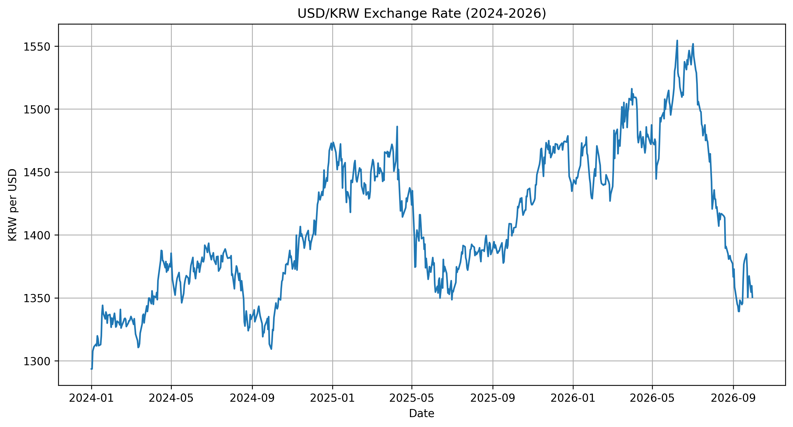
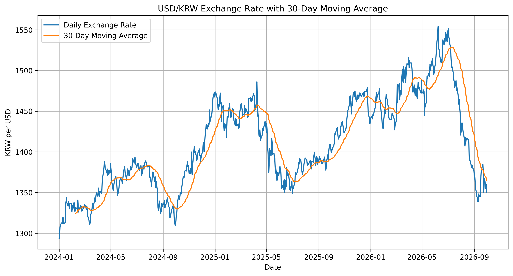
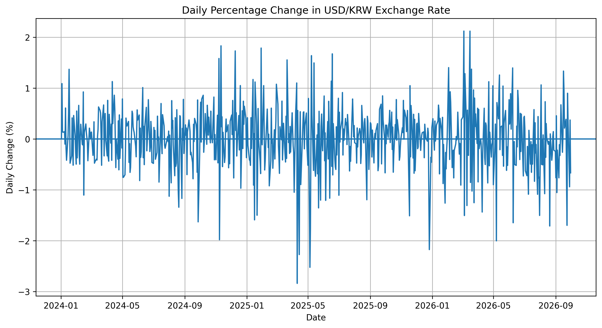
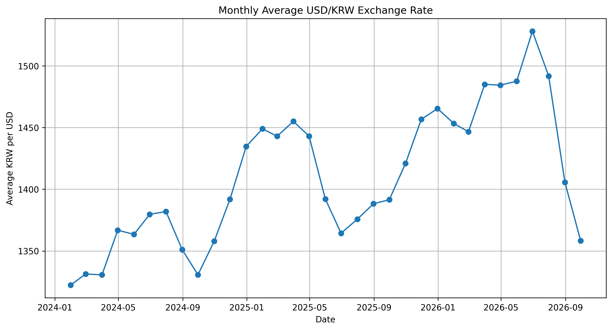

# 시계열 데이터를 활용한 2024~2026년 원/달러 환율 트렌드 분석

## 1. 분석 주제 및 선정 이유

원/달러 환율은 해외여행, 수입·수출, 투자 등 다양한 경제 활동과 밀접하게 관련된 지표이다. 또한 시간에 따라 지속적으로 변화하기 때문에 시계열 데이터의 특징을 분석하기에 적합하다.

본 분석에서는 2024년 1월부터 2026년 9월까지의 원/달러 환율 데이터를 활용하여 전체적인 환율 변화 흐름을 확인하고, 이동평균과 변화율 등의 시계열 분석 기법을 통해 단기 변동과 중장기 추세를 비교하고자 한다.

또한 급격한 변동이 나타난 시점과 월별 환율 수준의 차이를 확인하고, 시계열 분해를 통해 트렌드와 계절성도 구분해 보고자 한다.

---

## 2. 분석 질문

본 분석에서는 다음 네 가지 질문을 중심으로 데이터를 살펴보았다.

1. 2024~2026년 동안 원/달러 환율은 전체적으로 어떤 상승·하락 추세를 보였는가?
2. 단기적인 환율 변동을 완화했을 때 중장기적인 환율 흐름은 어떻게 나타나는가?
3. 원/달러 환율의 일별 변화율이 가장 크게 나타난 시기는 언제인가?
4. 월별 평균 환율에는 어떤 차이가 있으며, 트렌드와 계절성을 구분할 수 있는가?

### 질문의 우선순위와 목적

가장 우선적으로 확인한 것은 전체 환율 추세와 추세 전환 시점이다. 이후 이동평균을 통해 단기 변동을 줄인 흐름을 확인하고, 변화율을 통해 비정상적으로 큰 움직임을 탐색하였다. 마지막으로 월별 집계와 시계열 분해를 통해 장기 흐름과 반복적인 패턴이 존재하는지를 추가로 확인하였다.

---

## 3. 데이터 설명

- 데이터 출처: Yahoo Finance
- 티커: KRW=X
- 분석 기간: 2024-01-01 ~ 2026-09-30
- 데이터 개수: 713개
- 주요 컬럼: Open, High, Low, Close, Volume
- 주 분석 변수: Close
- 데이터 수집 방법: Python의 `yfinance` 라이브러리를 이용하여 일별 환율 데이터를 수집하였다.

데이터 수집에는 다음과 같은 방식이 사용되었다.

    yf.download(
        "KRW=X",
        start="2024-01-01",
        end="2026-10-01",
        interval="1d"
    )

수집된 데이터의 각 컬럼에서 결측치는 확인되지 않았다.

주말 및 일부 휴일에는 거래 데이터가 존재하지 않아 해당 날짜의 행 자체가 포함되지 않는다. 이는 행은 존재하지만 값만 비어 있는 결측치와는 구분하였다.

전체 기간의 Close 기준 평균 환율은 약 1,409.62원이었고, 최소값은 약 1,293.53원, 최대값은 약 1,554.48원이었다.

---

## 4. 데이터 정제 및 분석 방법

분석 과정은 다음 순서로 진행하였다.

**데이터 수집 → 데이터 구조 확인 → 결측치 확인 → 이상치 확인 → 시계열 분석 → 시각화 → 인사이트 도출**

본 분석에서는 일별 원/달러 환율 데이터 중 `Close` 값을 주요 분석 변수로 사용하였다.

적용한 분석 기법은 다음과 같다.

1. 전체 환율 추세 확인
2. 30일 이동평균
3. 일별 변화율
4. 월별 평균 집계
5. 시계열 분해
6. 7일·30일·60일 이동평균 비교

### 4.1 결측치 처리

각 컬럼에 대해 결측치를 확인한 결과 모든 컬럼에서 결측치가 0개로 확인되었다.

따라서 별도의 결측치 삭제나 대체 작업은 수행하지 않았다.

### 4.2 이상치 확인

이상치는 일별 변화율을 기준으로 IQR 방식을 사용하여 확인하였다.

IQR 방식은 다음과 같다.

- IQR = Q3 - Q1
- 하한 = Q1 - 1.5 × IQR
- 상한 = Q3 + 1.5 × IQR

실제 계산 결과는 다음과 같다.

- 이상치 기준 하한: 약 -1.45%
- 이상치 기준 상한: 약 +1.47%
- 이상치 후보 개수: 26개

해당 범위를 벗어나는 값은 통계적으로 큰 변동이지만, 환율 데이터에서는 실제 시장 충격이나 급격한 가격 변화가 중요한 정보가 될 수 있다.

따라서 이상치 후보 26개를 단순 오류로 판단하여 제거하지 않고 분석에 유지하였다.

### 4.3 트렌드, 계절성, 노이즈

시계열 데이터는 다음 세 가지 요소의 관점에서 살펴볼 수 있다.

- **트렌드(Trend)**: 장기간에 걸쳐 나타나는 상승 또는 하락 방향
- **계절성(Seasonality)**: 일정한 주기를 가지고 반복되는 패턴
- **노이즈(Noise)**: 트렌드와 계절성으로 설명하기 어려운 불규칙한 단기 변동

본 분석에서는 이동평균을 통해 단기 노이즈를 완화하고 추세를 확인하였다.

또한 월평균 환율 데이터에 대해 12개월 주기의 additive seasonal decomposition을 수행하여 관측값을 Trend, Seasonal, Residual로 나누어 살펴보았다.

### 4.4 분석 파라미터 선택 이유

30일 이동평균은 약 한 달 정도의 단기적인 변동을 완화하면서도 중기적인 방향을 확인하기 위한 기준으로 선택하였다.

다만 이동평균 기간에 따라 결과가 달라질 수 있기 때문에 7일, 30일, 60일 이동평균을 추가로 비교하였다.

7일 이동평균은 실제 움직임에 빠르게 반응하는 반면 노이즈가 상대적으로 많이 남고, 60일 이동평균은 더 부드러운 흐름을 보여주지만 실제 추세 변화보다 늦게 반응할 수 있다.

---

## 5. 분석 결과 및 시각화

### 5.1 전체 환율 추세

**시각화 목적:** 일별 원/달러 환율의 전체 흐름과 주요 상승·하락 구간을 확인하기 위한 그래프이다.

2024년 초 약 1,300원 수준이던 원/달러 환율은 분석 기간 동안 여러 차례 상승과 하락을 반복하였다.

2024년 중반까지 환율은 점차 상승한 뒤 하반기에 하락하는 모습을 보였고, 2024년 말부터 2025년 초까지 다시 크게 상승하였다.

이후 2025년 중반에는 약 1,350원대까지 하락했으며, 이후 다시 상승하여 2026년 중반에는 약 1,550원 수준까지 상승하였다.

그러나 2026년 중반 이후에는 다시 큰 폭으로 하락하여 2026년 9월에는 약 1,350원 수준까지 내려왔다.

따라서 분석 기간 전체를 하나의 상승 또는 하락 추세로 보기보다는 여러 차례의 추세 전환이 발생한 시계열로 해석하는 것이 적절하다.

---

### 5.2 30일 이동평균

**시각화 목적:** 일별 환율의 단기적인 변동을 완화하여 중장기적인 방향을 보다 명확하게 확인하기 위한 그래프이다.

30일 이동평균선은 일별 환율보다 변동폭이 작고 부드러운 형태를 보였다.

이를 통해 일별 데이터의 짧은 상승·하락보다 중장기적인 흐름을 쉽게 확인할 수 있었다.

특히 2025년 중반 이후 환율의 상승 추세가 비교적 명확하게 나타났으며, 2026년 중반 이후에는 이동평균선 역시 뚜렷한 하락 방향으로 전환되었다.

다만 이동평균은 과거 값을 평균하여 계산하기 때문에 실제 추세 변화보다 늦게 반응하는 **시차(lag)**가 발생할 수 있다는 한계가 있다.

---

### 5.3 일별 변화율

**시각화 목적:** 전일 대비 환율의 변화 정도를 계산하여 평소보다 큰 움직임이 나타난 시점을 확인하기 위한 그래프이다.

일별 변화율을 분석한 결과 대부분의 날짜에서는 비교적 작은 범위의 변동이 나타났지만, 일부 날짜에서는 큰 폭의 변화가 발생하였다.

- 가장 큰 상승일: 2026년 3월 4일
- 가장 큰 상승률: 약 +2.12%
- 가장 큰 하락일: 2025년 4월 10일
- 가장 큰 하락률: 약 -2.84%

IQR 방식으로 확인한 결과 총 26개의 날짜가 통계적인 이상치 후보로 나타났다.

하지만 실제 환율 시장의 큰 움직임일 가능성이 있기 때문에 해당 값은 삭제하지 않았다.

---

### 5.4 월별 평균 환율

**시각화 목적:** 일별 변동을 월 단위로 집계하여 기간별 환율 수준의 차이를 쉽게 비교하기 위한 그래프이다.

일별 데이터를 월별 평균으로 집계한 결과 단기적인 변동이 완화되고 전체적인 흐름이 더 명확하게 나타났다.

- 월평균 최저 환율: 2024년 1월 약 1,322.30원
- 월평균 최고 환율: 2026년 6월 약 1,528.09원

2024년 초에는 상대적으로 낮은 환율 수준이 나타났지만 이후 상승과 하락이 반복되었다.

2026년 6월에는 분석 기간 중 가장 높은 월평균 수준을 기록하였고, 이후 하반기에는 큰 폭으로 하락하였다.

월별 집계는 일별 데이터보다 중장기적인 수준 차이를 쉽게 보여준다는 장점이 있다.

반면 주별 또는 분기별로 집계할 경우에도 다른 수준의 패턴을 확인할 수 있기 때문에 집계 단위에 따라 해석 결과가 달라질 수 있다.

---

### 5.5 시계열 분해를 통한 트렌드와 계절성 확인

**시각화 목적:** 월평균 환율을 Trend, Seasonal, Residual로 분리하여 장기 흐름과 반복 패턴을 구분하기 위한 그래프이다.

월별 평균 환율 데이터를 대상으로 12개월 주기의 additive seasonal decomposition을 수행하였다.

이를 통해 관측값(Observed)을 다음과 같이 분리하였다.

- Trend: 장기적인 환율 방향
- Seasonal: 12개월 주기를 기준으로 반복되는 패턴
- Residual: Trend와 Seasonal로 설명되지 않는 나머지 변동

분해 결과 장기적인 환율의 상승과 하락 방향은 Trend에서 비교적 명확하게 확인할 수 있었다.

Seasonal 성분에서도 일정한 형태의 패턴이 나타났지만 본 데이터의 분석 기간은 2024년 1월부터 2026년 9월까지 약 2년 9개월에 불과하다.

따라서 동일한 연간 패턴이 충분히 반복되었다고 보기 어렵기 때문에, 현재 나타난 Seasonal 성분만으로 원/달러 환율에 안정적인 계절성이 존재한다고 단정하지 않았다.

본 분석에서는 계절성보다 기간별 추세 변화가 더 뚜렷한 특징이라고 판단하였다.

Residual은 트렌드와 계절성으로 설명되지 않는 불규칙한 단기 움직임을 나타낸다.

---

### 5.6 이동평균 기간에 따른 결과 비교

**시각화 목적:** 하나의 이동평균 기간에만 의존하지 않고, 분석 기간 선택이 결과 해석에 미치는 영향을 확인하기 위한 그래프이다.

30일 이동평균의 결과가 기간 선택에 따라 달라질 수 있는지 확인하기 위해 7일, 30일, 60일 이동평균을 비교하였다.

7일 이동평균은 실제 환율 변화에 가장 빠르게 반응했지만 일별 데이터의 변동이 상대적으로 많이 남았다.

30일 이동평균은 단기 변동을 줄이면서도 주요 상승·하락 흐름을 비교적 빠르게 반영하였다.

60일 이동평균은 가장 부드러운 형태를 보였지만 추세 전환에 가장 늦게 반응하였다.

따라서 이동평균 기간에 따라 같은 데이터에서도 추세 전환 시점이 다르게 보일 수 있으며, 30일이라는 기준 역시 절대적인 기준이 아니라 분석 목적에 따라 선택된 하나의 기준임을 확인하였다.

---

## 6. 주요 인사이트

### 인사이트 1. 원/달러 환율은 단일한 방향으로 움직이지 않았다.

**관찰(Fact)**

2024년부터 2026년까지 원/달러 환율은 여러 차례 상승과 하락을 반복하였다. 2024년 초 약 1,300원 수준에서 시작한 환율은 2026년 중반 약 1,550원 수준까지 상승했지만 이후 다시 약 1,350원 수준까지 하락하였다.

**해석(Why)**

전체 기간을 하나의 상승 또는 하락 추세로 단순화하면 중간에 발생한 추세 전환을 놓칠 수 있다.

**행동(Action)**

향후 환율 흐름을 분석할 때는 전체 기간의 평균적인 방향만 보기보다 상승·하락 국면을 구간별로 나누어 비교하고, 각 추세 전환 시점의 외부 경제지표를 함께 확인할 필요가 있다.

---

### 인사이트 2. 이동평균은 중장기 추세를 확인하는 데 유용하였다.

**관찰(Fact)**

일별 환율에서는 짧은 기간의 상승과 하락이 빈번하게 나타났지만 30일 이동평균에서는 보다 부드러운 방향성이 나타났다.

**해석(Why)**

이동평균은 일별 노이즈를 완화하여 중장기적인 방향과 추세 전환을 확인하는 데 유용하다.

다만 실제 환율 변동보다 늦게 반응하는 시차 문제가 존재한다.

**행동(Action)**

환율 모니터링에서는 일별 값만 사용하는 것보다 이동평균을 함께 확인하되, 이동평균만으로 판단하지 않고 원자료와 함께 비교하는 것이 적절하다.

또한 분석 목적에 따라 7일, 30일, 60일 등 다른 기간도 함께 비교할 필요가 있다.

---

### 인사이트 3. 일부 날짜에서는 평소보다 큰 환율 변동이 발생하였다.

**관찰(Fact)**

가장 큰 상승률은 2026년 3월 4일의 약 +2.12%였고, 가장 큰 하락률은 2025년 4월 10일의 약 -2.84%였다.

IQR 기준으로 총 26개의 이상치 후보가 확인되었다.

**해석(Why)**

일부 시점에는 일반적인 일별 움직임보다 큰 시장 충격이 존재했을 가능성이 있다.

다만 본 분석에서는 환율 데이터만 사용했기 때문에 실제 원인을 특정할 수는 없다.

**행동(Action)**

IQR 기준을 벗어난 날짜를 우선 조사 대상으로 선정하고, 해당 날짜 전후의 미국·한국 기준금리 발표, 달러지수, 주요 경제지표 등을 추가로 비교하면 변동 원인 분석을 확장할 수 있다.

---

### 인사이트 4. 월별 집계는 기간별 환율 수준 차이를 명확하게 보여주었다.

**관찰(Fact)**

월평균 환율은 2024년 1월 약 1,322.30원으로 가장 낮았으며 2026년 6월 약 1,528.09원으로 가장 높았다.

**해석(Why)**

월평균으로 집계하면 일별 변동의 영향이 줄어들어 기간별 환율 수준 차이를 보다 쉽게 확인할 수 있다.

**행동(Action)**

장기적인 흐름을 비교할 때는 일별 자료뿐 아니라 월별 또는 분기별 집계를 함께 사용하고, 분석 목적에 따라 적절한 집계 단위를 선택할 필요가 있다.

---

## 7. 결론 및 한계점

본 분석을 통해 2024년부터 2026년까지 원/달러 환율은 하나의 지속적인 추세보다는 여러 차례 상승과 하락 국면을 보였음을 확인하였다.

30일 이동평균을 이용하여 단기적인 노이즈를 줄인 중장기 흐름을 확인할 수 있었고, 일별 변화율 분석을 통해 급격한 변동이 발생한 날짜를 확인할 수 있었다.

또한 월별 평균 분석을 통해 기간별 환율 수준의 차이를 쉽게 확인할 수 있었으며, 시계열 분해를 통해 Trend와 Seasonal 성분을 분리해 보았다.

다만 본 분석에는 다음과 같은 한계가 있다.

첫째, 원/달러 환율 데이터만 사용했기 때문에 금리, 물가, 달러지수, 정치적 사건, 국제 금융시장 상황 등 외부 변수의 영향을 직접 분석하지 못하였다.

둘째, 특정 날짜에 큰 환율 변화가 발생하였더라도 본 분석만으로 해당 변화의 원인을 설명할 수 없다.

셋째, 분석 기간이 약 2년 9개월로 짧기 때문에 Seasonal decomposition에서 나타난 패턴이 장기간 반복되는 안정적인 계절성인지 확인하기 어렵다.

넷째, 이동평균의 기간을 어떻게 선택하는지에 따라 추세 전환 시점이 다르게 나타날 수 있다.

### 향후 추가 분석 우선순위

추가 분석에서는 다음 데이터를 우선적으로 결합할 수 있다.

1. **미국 및 한국 기준금리**
   - 중앙은행의 공식 발표 자료를 이용하여 확보
   - 양국의 금리 차이와 환율의 관계를 확인

2. **달러지수(DXY)**
   - 금융시장 데이터를 이용하여 확보
   - 글로벌 달러 강세와 USD/KRW 변화의 관계를 확인

3. **한국·미국 물가 및 주요 경제지표**
   - 정부 또는 공식 통계기관 자료 활용
   - 물가 및 경제 상황 변화와 환율의 관계를 확인

이를 통해 단순히 환율이 언제 움직였는지를 넘어 왜 움직였는지에 대한 분석으로 확장할 수 있다.

---

## 8. AI 사용 로그

### 8.1 사용 작업

AI는 다음 작업에 활용하였다.

- 분석 주제 및 분석 질문 구성
- Python 데이터 분석 코드 작성 보조
- 결측치 및 이상치 분석 방법 탐색
- 시각화 코드 작성
- 분석 방법 대안 탐색
- 보고서 문장 구성 및 표현 개선

### 8.2 사용 이유

Python 코드 작성 시간을 줄이고 시계열 분석에 적합한 방법을 탐색하기 위해 AI를 활용하였다.

또한 다양한 분석 방법의 대안을 확인하고 결과를 명확하게 설명하기 위한 문장 구성에도 AI의 도움을 받았다.

### 8.3 검증 방법 및 실행 결과

AI가 제안한 코드는 Google Colab에서 직접 실행하여 오류 여부와 결과를 확인하였다.

검증 과정에서 확인한 주요 결과는 다음과 같다.

- 데이터 개수: 713개
- 결측치: 모든 주요 컬럼 0개
- Close 평균: 약 1,409.62원
- Close 최소값: 약 1,293.53원
- Close 최대값: 약 1,554.48원
- 최대 일별 상승률: 약 +2.12%
- 최대 일별 하락률: 약 -2.84%
- IQR 이상치 후보: 26개
- 월평균 최저: 2024년 1월 약 1,322.30원
- 월평균 최고: 2026년 6월 약 1,528.09원

주요 수치는 Python 출력과 직접 비교하여 보고서에 반영하였다.

### 8.4 AI 제안에 대한 본인 검토 및 재구성 사례

본 프로젝트에서는 AI가 생성한 분석 결과를 그대로 사용하지 않고 실제 실행 결과와 분석 목적을 확인한 뒤 내용을 수정하거나 제외하였다.

#### 사례 1. 환율 변화의 원인 해석

**AI 제안**

급격한 환율 변화를 금리, 정책 발표, 경제 이벤트 등과 연결해 해석하는 방향을 제안하였다.

**본인 검토**

현재 데이터에는 환율 정보만 포함되어 있기 때문에 특정 경제 이벤트와 환율 사이의 인과관계를 직접 증명할 수 없다고 판단하였다.

**최종 수정**

구체적인 원인을 단정하지 않고 "외부 경제·정책·시장 이벤트의 영향을 받았을 가능성이 있으나 본 데이터만으로 원인을 확인할 수 없다"는 형태로 수정하였다.

#### 사례 2. 이상치 처리

**AI 제안**

IQR 방식을 이용하여 통계적 이상치를 탐지하였다.

**본인 검토**

환율에서는 큰 변동 자체가 실제 시장 상황을 보여주는 중요한 정보일 수 있다고 판단하였다.

**최종 수정**

IQR 기준 밖에 있는 26개 값을 삭제하지 않고 분석에 유지하였다.

#### 사례 3. 이동평균 기간 선택

**AI 제안**

30일 이동평균을 사용하여 중장기적인 추세를 확인하는 방법을 제안하였다.

**본인 검토**

하나의 이동평균 기간만 사용하면 결과가 선택한 기간에 따라 달라질 수 있다는 한계가 있다고 판단하였다.

**최종 수정**

7일, 30일, 60일 이동평균을 추가 비교하여 기간 선택에 따라 추세 반응 속도가 달라진다는 점을 확인하였다.

### 8.5 최종 판단 원칙

AI는 분석 방법과 코드의 초안을 만드는 보조 도구로 사용하였다.

최종 분석 기준, 이상치 처리 여부, 원인 해석 범위, 한계점 및 결론은 실제 데이터와 실행 결과를 확인한 후 직접 결정하였다.
